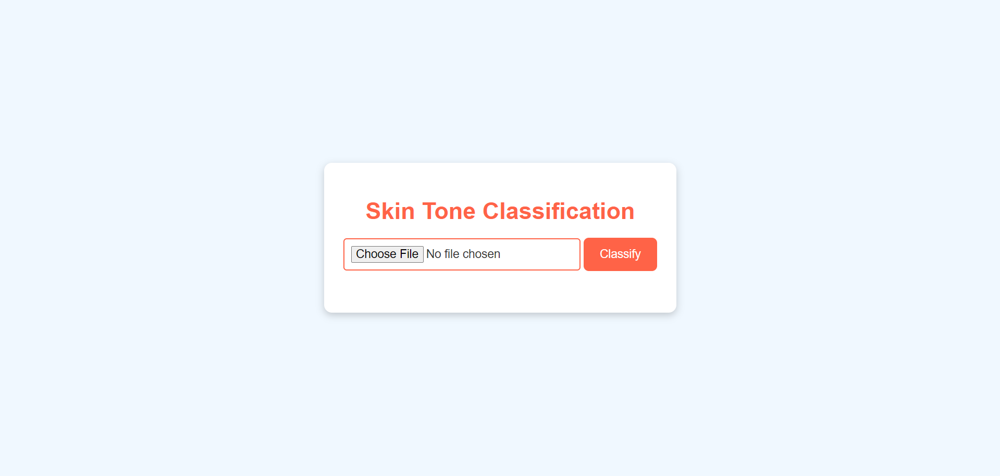

# Skin_Tone_Classification
Project Overview In this project, I developed a skin tone classification model to classify images into different skin tone categories: dark, light, lighten, mid dark, mid light, mid-dark, and mid-light. The model uses Convolutional Neural Networks (CNNs) to achieve high accuracy and is deployed using Flask to create an interactive web application.

  

# Key Features:
Custom CNN Architecture: Leveraged the power of deep learning to create a model that accurately classifies skin tones.
User-Friendly Web Interface: Developed with Flask, allowing users to upload images and receive predictions in real-time.
Interactive Results: The application displays the uploaded image along with the predicted skin tone class on the same page.

# Technical Details:
Model Training: Used TensorFlow and Keras for building and training the model.
Deployment: The Flask app is set up to handle image uploads, process them with the pre-trained model, and display results.
Technologies Used: Python, TensorFlow, Keras, Flask, HTML/CSS, and JavaScript.

Ensure you have Python installed and set up a virtual environment.
Install necessary packages using pip install -r requirements.txt (including TensorFlow, Flask, and other dependencies).

# Prepare Your Project Structure:

Create a directory structure with app.py (Flask app), templates (HTML files), static (CSS, JS, images), and model (pre-trained model).

# Run the Flask Application:

Navigate to the project directory in your terminal and run python app.py.
Your application should be live on http://127.0.0.1:5000 .

  

# Access and Test:

Open the web application in your browser, upload an image, and see the results.
